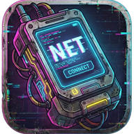

# Cyber Phone

Changelog: CHANGELOG.md

## The AntiFragile Communication Suite.

Cyber Phone is a sovereign, privacy-focused communication solution for modern Android. It is designed for High-Entropy Environments where reliance on centralized infrastructure is a liability.

We are building the **Shadow Stack.**
## The Philosophy: Via Negativa

Modern communication apps are bloated surveillance engines. They optimize for data extraction, not user agency. They add complexity to sell you convenience.

Cyber Phone solves the communication problem by Subtraction:

*   No Google Play Services

*   No Analytics

*   No Cloud Dependencies

*   No Admin Access for the State

It is a Hardened Interface combining the utility of a modern dialer/messenger with the resilience of a mesh network
## The Architecture
1. Sovereign Interface

A fully functional replacement for the stock Phone and SMS apps, built on hardened open-source telephony and messaging modules.

*   Rich Dialer & In-Call UI

*   Caller ID Enrichment that uses local libphonenumber libraries for geocoding and carrier lookup

*   Integrated system contacts with in-app editing

2. Signal-to-Noise Optimization

The Regime and the Market flood your bandwidth with noise. Cyber Phone creates a Cognitive Firewall.

*   Automatic sorting of SMS (Main/OTP/Spam)

*   Regex patterns, neighbor spoofing protection, and cached community blocklists

*   Spam notifications are suppressed. Your attention is a scarce resource; we protect it

3. Cryptographic Autonomy

*   E2E SMS Encryption: Local key generation and exchange. Keys are stored in your contact list, editable by you

4. Post-Infrastructure Resilience
This is the core of the **Protocol.**
Cyber Phone integrates the Reticulum Network Stack to enable off-grid communication.

*   Seamless switching between Cellular and Mesh modes with an optional fallback mode

*   Capable of routing messages via LoRa and WiFi

*   If the ISP cuts the internet or the Telco towers go dark, the Mesh stays up

5. On-Device Intelligence

*   Optional AI spam classification that runs entirely on-device and is privacy friendly

6. Sovereign Wallet

*   Native in-app Bitcoin + Lightning wallet with federation-aware backend switching

*   Fedimint support for e-cash style transfers across encrypted messaging and mesh channels

*   Contact-integrated pay/request flows and wallet destination fields

*   Encrypted wallet backups with passphrase protection and restore support

## Privacy & Network Behavior

Cyber Phone does not ship analytics or Play Services. Network access is only used for user-enabled features:

*   **Community spam reputation (YACB)**: Optional. When enabled, the app downloads community reputation data and can submit ratings for numbers you explicitly mark as spam/not spam.
*   **AI spam model updates**: Optional. Models are downloaded only when you select a model and trigger updates.
*   **Mesh networking**: Optional. Only runs when Mesh mode or routing is enabled in Settings.

By default, these network-backed features are disabled until you opt in.

## F-Droid Notes

*   No analytics SDKs or Play Services are included.
*   Network behavior is feature-gated and opt-in as described above.
*   Release builds are produced from pinned dependency versions and static app version metadata.
*   Reviewer-facing submission details: `docs/F-DROID_SUBMISSION_NOTES.md`.

## Permissions

Cyber Phone needs core telephony permissions to function as a full replacement Phone/SMS app:

*   Phone + Call Log (dialer, call history, spam blocking)
*   Contacts (integrated phonebook, caller ID, in-app editing)
*   SMS/MMS (messaging, classification, notifications)
*   Notifications + full-screen alerts (incoming call/message UI)

## Build the Node

To compile the app:

*   Clone the Repo

*   Ensure Android SDK and build tools are installed

*   Open in Android Studio and build the app module

*   Provide a keystore.properties file for release signing

## License

This project is licensed under AGPL-3.0.

This is a strategic choice. It prevents Tivoization and Corporate Capture. If you fork this code to build a proprietary tool or lock it down inside a closed device, you are legally required to open-source your modifications.

The Code belongs to the Commons.

## Acknowledgements
- Fossify Commons (https://github.com/FossifyOrg/Commons)
- Yet Another Call Blocker (https://gitlab.com/xynngh/YetAnotherCallBlocker)
- Reticulum Network Stack (https://github.com/markqvist/Reticulum)
- LXMF (https://github.com/markqvist/LXMF)
- Fedimint (https://github.com/fedimint/fedimint)
- Fedimint Web SDK (https://www.npmjs.com/package/@fedimint/core-web)
- Lightning Dev Kit / ldk-node-android (https://github.com/lightningdevkit/ldk-node)
- libphonenumber (https://github.com/google/libphonenumber)
- Hugging Face (https://huggingface.co)
- Google AI Edge / MediaPipe models (https://ai.google.dev/edge)
- OpenAI Codex (implementation assistance)
